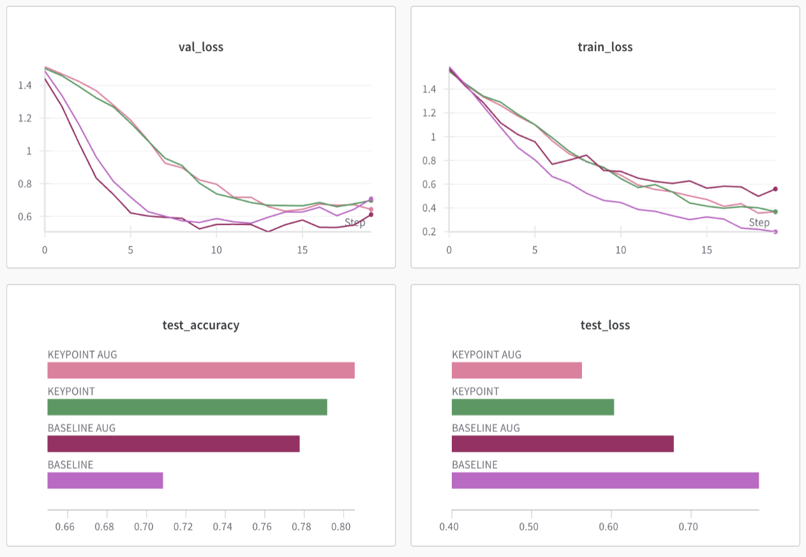
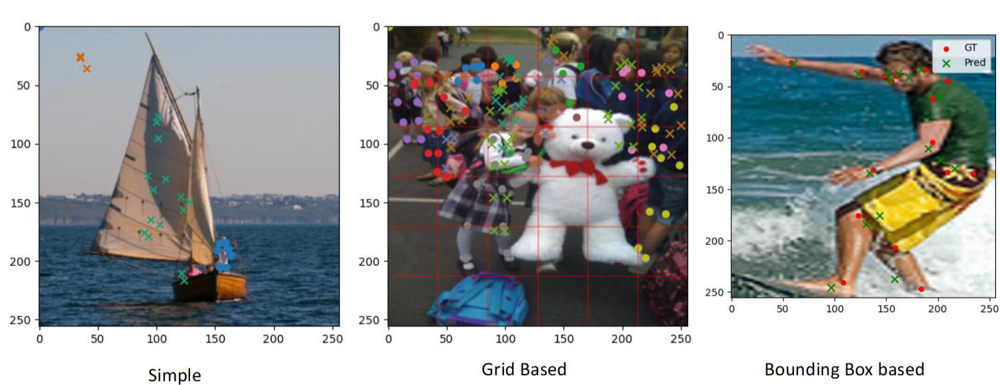
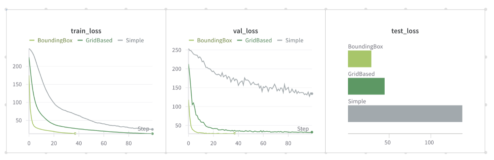

# Action detection
## Goal: Improve action recognition using keypoints guidance        
Recognise specific actions:  
- Jump
- Pullup
- Pushup
- Wave
- Sit

## Motivation
Our team is highly interested in computer vision, and we managed to find great database. 
Additionally, such model has many **interesting use cases** (for example Kinect-like device, or CCTV monitoring).

## Dataset
HMDB51 Dataset consists of **51 action labels** and over **6'000 videos**. 
Each video represents human performing some activity.

## Models
### Baseline
For comparison we created a baseline model, which consisted of:
- Pretrained **ResNet18** backbone
- **Dense Linear layers** for classifier
- **Cross Entropy Loss**
- **Adam** optimizer
- Input data **Resized and Normalized**
- Optional **augmentation**:
    - Blur, Grayscale, Jitter, Sharpness

### Keypoint based
This model was created for our thesis - we supplied the model with additional data about keypoints of humans in the frame:
- Pretrained **ResNet18** for images
- **Dense Linear layers** for keypoints
- Both outputs combined with **Dense Layers**

## Results
The **keypoint supported** model **performed better**, by over 10% (accuracy), than baseline.

## Future works
Main idea that could be implemented, to possibly further improve model accuracy, was **preprocessing of keypoints** data
in order to supply model with more useful information (for example instead of keypoints positions, informations how keypoints position changed between frames). 

Additionally, a **Recurring Neural Network** could have been used and tested, as it was another natural approach to such problem.

# Keypoints detection
Since we were using keypoints in the action detection, we decided to train our own model for their detection.
To stay true with the project motivation, we had 2 approaches - baseline, and **bounding-box supported** - to compare their performance.

## Dataset  
COCO dataset consists of over **50'000 images**, so on the start (because of our hardware limiatations) we removed all samples that had no kepoints.

## Models
### Baseline
We tries 2 approaches with baseline model: 
- **Simple**, where we input the image directly and then expet a list of keypoints
- **Grid Based** - Yolo style approach, where the image is segmeneted into grid, and each person is assigned to _closest_ cell

And compared them with the Bounding Box supported one.

All models used:
- **ResNet18** as backbone
- **Convolutional** Layers to predict output (in _Yolo_ fashion)
- **Mean Absolute Error** or **Object Keypoint Simmilarity** loss
- **Adam** optimizer
- Image **normalization** with **augmentation** for training set

## Results

## Future works
After analyzing the results, where model guided with bounding boxes overperformed other approaches,
we came up with statement that problem of **finding keypoints is very simmilar to bounding box detection problem**.  
New approach could be tested, where model is using same architecture as _yolo bounding box detection_, 
with added keypoints information for each bounding box, to be predicted.

---

# How to use
## Downloading the data
To download coco keypoints dataset, simply run the `./data/download_coco.sh` script.   
To download actions dataset, run the `./data/download_hmdb51.sh` script.  

## Training the models
In the `notebooks` folder you can find folders with Jupyter notebooks for given subtask:
- `main` - notebooks for training the actions detection model
- `actions` - notebooks for actions dataset preparation
- `keypoints` - notebooks for keypoints detection model training
- `boundingbox` - notebooks for bounding box custom model (WIP)

